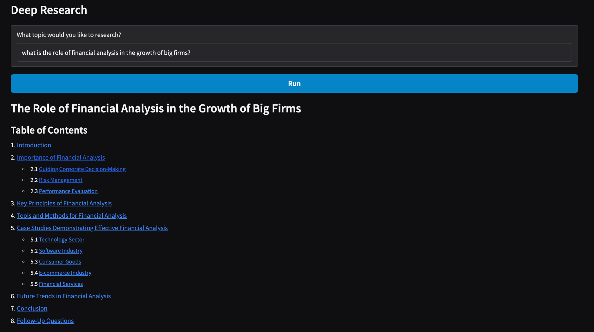
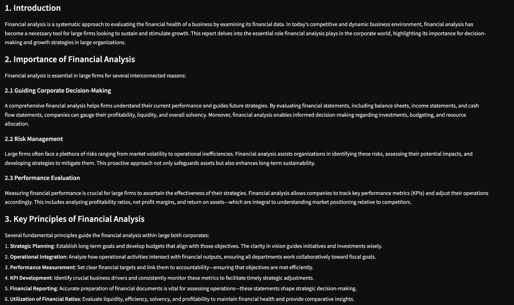

# Deep Researcher AI Agent

A Gradio-powered **multi-agent deep research app** that:
1) plans targeted web searches,  
2) summarizes sources,  
3) writes a structured long-form report, and  
4) (optionally) sends the final report via email using SendGrid.

Built using **OpenAI Agents SDK**, **Gradio**, and managed with **uv**.

---

## Demo

> Add your screenshots to the repo and update the paths below.

### Gradio UI


### Generated report example


---

## Features

- **Interactive Gradio UI**: enter any topic and generate a report in seconds.
- **Planner Agent**: creates a small web search plan for the query.
- **Search Agent**: runs web searches and summarizes results (short, dense summaries).
- **Writer Agent**: produces a detailed markdown report (5–10 pages / 1000+ words target).
- **Email Agent (optional)**: converts the report into HTML and emails it via SendGrid.
- **Tracing**: prints a trace URL so you can inspect runs (if enabled in your setup).

---

## Project Structure

```text
deep_research/
  deep_research.py        # Gradio app entry
  research_manager.py     # Orchestrates the workflow
  planner_agent.py        # Generates web search plan
  search_agent.py         # WebSearchTool-based summarizer
  writer_agent.py         # Long-form report writer
  email_agent.py          # Sends HTML email using SendGrid
main.py                   # Optional entrypoint (if you use it)
pyproject.toml            # Dependencies & project config
uv.lock                   # Locked dependency versions
